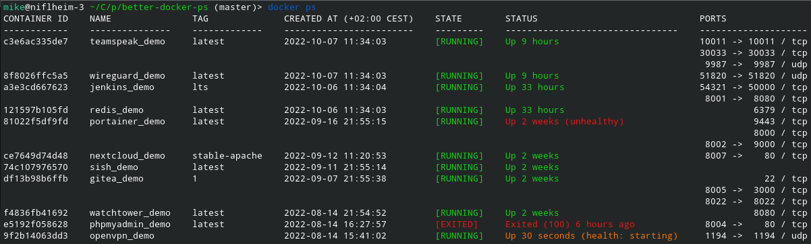
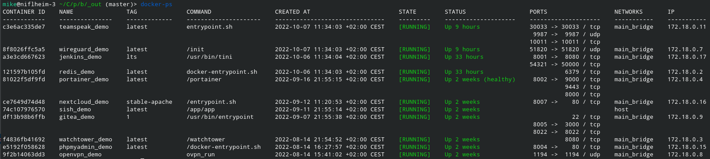
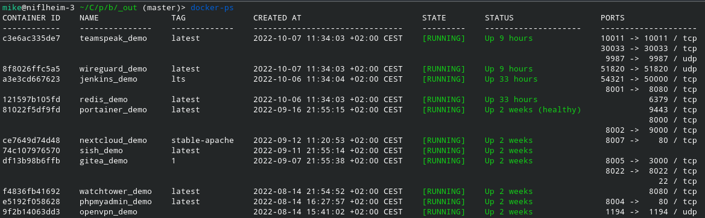
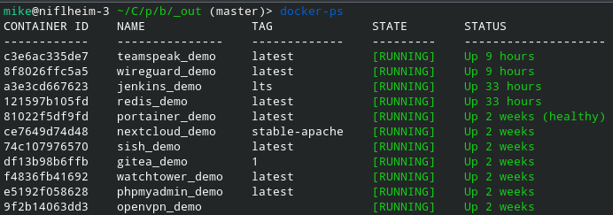

# ./dops - better `docker ps` 
A replacement for the default docker-ps that tries really hard to fit within your terminal width.



## Rationale

By default, my `docker ps` output is really wide and every line wraps around into three.
This (obviously) breaks the tabular display and makes everything chaotic.  
*(This gets especially bad if one container has multiple port mappings, and they are all displayed in a single row)*
It doesn’t look like we’ll get improved output in the foreseeable future (see [moby#7477](https://github.com/moby/moby/issues/7477)), so I decided to make my own drop-in replacement.  

## Features

 - All normal commandline flags/options from docker-ps work *(almost)* the same.
 - Write multi-value data (like multiple port mappings, multiple networks, etc.) into multiple lines instead of concatenating them.
 - Add color to the STATE and STATUS column (green / yellow / red).
 - Automatically remove columns in the output until it fits in the current terminal width.
 - sort the output with the `--sort` argument
 - Enter watch mode with the `--watch` argument

More Changes from default docker-ps:
 - Show (by default) the container-cmd without arguments.
 - Show the ImageName (by default) without the registry prefix, and split ImageName and ImageTag into two columns.
 - Added the columns IP and NETWORK to the default column set (if they fit)
 - Added support for a few new columns (via --format):  
   `{{.ImageName}`, `{{.ImageTag}`, `{{.Tag}`, `{{.ImageRegistry}`, `{{.Registry}`, `{{.ShortCommand}`, `{{.LabelKeys}`, `{{.IP}`                         
 - Added options to control the color-output, the used socket, the time-zone and time-format, etc (see `./dops --help`) 

## Getting started

### Generic Linux (e.g. Debian/Fedora/...)
 - Download the latest binary from the [releases page](https://github.com/Mikescher/better-docker-ps/releases) and put it into your PATH (eg /usr/local/bin)
 - You can also use the following one-liner (afterwards you can use the `dops` command everywhere):
```
sudo wget "https://github.com/Mikescher/better-docker-ps/releases/latest/download/dops_linux-amd64-static" -O "/usr/local/bin/dops" && sudo chmod +x "/usr/local/bin/dops"
```

### ArchLinux
 - Alternatively you can use one of the AUR packages (under Arch Linux):
    * https://aur.archlinux.org/packages/dops-bin (installs `dops` into your PATH)
    * https://aur.archlinux.org/packages/dops-git (installs `dops` into your PATH)
 - or the homebrew package: 
    * `brew tap mikescher/tap && brew install dops`

### Optional steps
 - Alias the docker ps command to `dops` (see [section below](#usage-as-drop-in-replacement))

## Screenshots

  
All (default) columns visible

&nbsp;

  
Output on a medium sized terminal

&nbsp;

  
Output on a small terminal

&nbsp;

## Usage as drop-in replacement

You can fully replace docker ps by creating a shell function in your `.bashrc` / `.zshrc`...

~~~sh
docker() {
  case $1 in
    ps)
      shift
      command dops "$@"
      ;;
    *)
      command docker "$@";;
  esac
}
~~~

This will alias every call to `docker ps ...` with `dops ...` (be sure to have the dops binary in your PATH).

If you are using the fish-shell you have to create a (similar) function:

~~~fish
function docker
    if test -n "$argv[1]"
        switch $argv[1]
            case ps
                dops $argv[2..-1]
            case '*'
                command docker $argv[1..-1]
        end
    end
end
~~~

## Changing the output format

By default dops tries to be "intelligent" and find the best output format for your terminal width.
The current output formats (= table columns) are defined in the [options.go](https://github.com/Mikescher/better-docker-ps/blob/master/cli/options.go).
The first format that fits in your terminal width is used.

But you can also override it by supplying a `--format` parameter. If you supply more than one `--format` parameter the first one that fits your terminal is used (same logic as with the default ones...)

Normally only simple columns aka `{{.Status}}` are supported.  
But you can also use the full golang template syntax (e.g. `{{ printf "%.15s" .Command }}`).
In this case it can be useful to specify the column header by prefixing it with a colon (`SHORTENED NAME:{{ printf "%.10s" (join .Names ";") }}`)

The following functions are defined in these templates (plus the [default go functions](https://pkg.go.dev/text/template)):
 - `join`: strings.Join
 - `array_last`: v\[-1\]
 - `array_slice`: v\[a..b\] 
 - `in_array`: v1.contains(v2)
 - `json`: json.Marshal(v)
 - `json_indent`: json.MarshalIndent(v, "", "  ")
 - `json_pretty`:  json.Indent(v, "", "  ")
 - `coalesce`: v1 ?? v2
 - `to_string`: fmt.Sprintf("%v", v)
 - `deref`: *v
 - `now`: time.Now()
 - `uniqid`: UUID

Examples:
~~~~
$ ./dops --format "table {{.ID}}"
$ ./dops --format "table {{.ID}}\\t{{.Names}}\\t{{.State}}"

$ ./dops --format "idlist"

$ ./dops --format "table {{.ID}}\\t{{.Names}}\\t{{.State}}"  --format "table {{.ID}}\\t{{.Names}}" --format "table {{.ID}}"

$ ./dops --format "ID: {{.ID}}; Name: {{.Names}}"

$ ./dops -aq

$ ./dops --sort "IP" --sort-direction "ASC"

$ ./dops --format "table {{.ID}}\\tCMD:{{ printf \"%.15s\" .Command }}"
$ ./dops --format "table {{.ID}}\\tNAME:{{ printf \"%.10s\" (join .Names \";\") }}"

~~~~

## Persistant configuration

You can also configure some/most of the options via a configuration file.  
Place a TOML formatted file in `$HOME/.config/dops.conf` / `$XDG_CONFIG_HOME/dops.conf`.

The following keys are supported:
 - verbose
 - silent
 - timezone
 - timeformat
 - timeformat-header
 - color
 - socket
 - all
 - size
 - filter (= string array)
 - format (= string array)
 - last
 - latest
 - truncate
 - header (= true / false / simple)
 - sort (= string array)
 - sort-direction (= string array)

Example:
```toml
verbose = 0

timezone = "Europe/Berlin"

format = [
   "table {{.ID}}\t{{.Names}}\t{{.State}}\t{{.Status}}",
   "table {{.ID}}\t{{.Names}}\t{{.State}}",
   "table {{.ID}}\t{{.Names}}",
   "table {{.ID}}",
]

header = "simple"
```

## Manual

Output of `./dops --help`:

~~~~~~
better-docker-ps

Usage:
  dops [OPTIONS]                     List docker container

Options (default):
  -h, --help                         Show this screen.
  --version                          Show version.
  --all , -a                         Show all containers (default shows just running)
  --filter <ftr>, -f <ftr>           Filter output based on conditions provided
  --format <fmt>                     Pretty-print containers using a Go template
  --last , -n                        Show n last created containers (includes all states)
  --latest , -l                      Show the latest created container (includes all states)
  --no-trunc                         Don't truncate output (eg ContainerIDs, Sha256 Image references, commandline)
  --quiet , -q                       Only display container IDs
  --size , -s                        Display total file sizes

Options (extra | do not exist in `docker ps`):
  --silent                           Do not print any output
  --timezone                         Specify the timezone for date outputs
  --color <true|false>               Enable/Disable terminal color output
  --no-color                         Disable terminal color output
  --socket <filepath>                Specify the docker socket location (Default: `auto` - which calls the docker cli to determine the socket)
  --timeformat <go-time-fmt>         Specify the datetime output format (golang syntax)
  --no-header                        Do not print the table header
  --simple-header                    Do not print the lines under the header
  --format <fmt>                     You can specify multiple formats and the first one that fits your terminal widt will be used
  --sort <col>                       Sort output by a specific column, use the same identifier as in --format, only useful together with table formats 
  --sort-direction <ASC|DESC>        The sort direction, only useful in combination with --sort
  --watch <interval>, -w <interval>  Automatically refresh output periodically (interval is optional, default: 2s) 

Available --format keys (default):
  {{.ID}}                            Container ID
  {{.Image}}                         Image ID
  {{.Command}}                       Quoted command
  {{.CreatedAt}}                     Time when the container was created.
  {{.RunningFor}}                    Elapsed time since the container was started.
  {{.Ports}}                         Published ports. ([!] differs from docker CLI, these are only the published ports)
  {{.State}}                         Container status
  {{.Status}}                        Container status with details
  {{.Size}}                          Container disk size.
  {{.Names}}                         Container names.
  {{.Labels}}                        All labels assigned to the container.
  {{.Label}}                         [!] Unsupported
  {{.Mounts}}                        Names of the volumes mounted in this container.
  {{.Networks}}                      Names of the networks attached to this container.

Available --format keys (extra | do not exist in `docker ps`):
  {{.ImageName}}                     Image ID (without tag and registry)
  {{.ImageTag}}, {{.Tag}}            Image Tag
  {{.ImageRegistry}}, {{.Registry}}  Image Registry
  {{.ShortCommand}}                  Command without arguments
  {{.LabelKeys}}                     All labels assigned to the container (keys only)
  {{.ShortPublishedPorts}}           Published ports, shorter output than {{.Ports}}
  {{.LongPublishedPorts}}            Published ports, full output with IP
  {{.ExposedPorts}}                  Exposed ports
  {{.PublishedPorts}}                Published ports
  {{.NotPublishedPorts}}             Exposed but not published ports
  {{.PublicPorts}}                   Only the public part of published ports
  {{.IP}}                            Internal IP Address
~~~~~~
